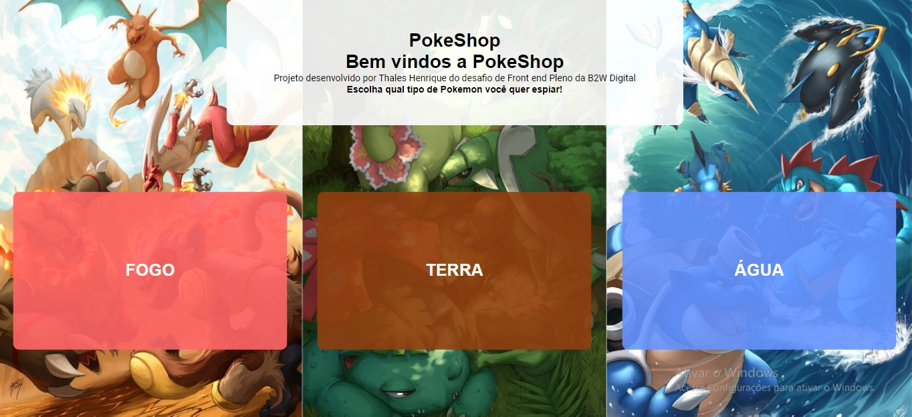

# PokeShop
> Aplicação desenvolvida para a vaga de Front end  Pleno da B2W Digital.

    A aplicação está hospedada no ambiente Heroku, clique abaixo para utilizar
   ## [Clique aqui para acessar a aplicação](https://pokeshop-b2w.herokuapp.com/) 
## Sobre a aplicação:
>PokeShop é uma loja de pokemons onde o usuario poderá visualizar preços e adquirir pokemons de acordo com o tipo do pokemon. A Pokeshop possui 3 tipos de lojas: Água, Fogo e Dragão. Ao escolher uma das lojas, o design e as cores da aplicação mudam, assim como os pokemons. O Usuario poderá desfrutar de um design responsivo, disponivel para qualquer tela e acompanhar o pedido atraves do carrinho, se por acaso o usuário fechar a aba e entrar novamente, poderá ver seu carrinho de compras salvos. Após realizar a compra, é possivel ver tambem os pedido na Aba Pedidos da aplicação.

## Tecnologias utilizadas
* #### <b>HTML5
* #### <b>CSS3
* #### <b>ReactJS
* #### <b>Typescript
* #### <b>React Hooks (ContextApi, useState, useEffect)
* #### <b>React-Testing-Library

## Recursos utilizados
* #### styled-components
* #### react-router-dom
* #### axios
* #### moment
* #### react-responsive-modal
* #### react-icons
* #### sweetalert

## Configuração
* #### Clonar o projeto
* ####  Rodar os comandos:
    * #### npm install
    * #### npm start

## Funcionalidades do Sistema
 * #### Escolha de 2 lojas dos tipos (Fogo, Água)
 * #### Listagem de Pokemons
 * #### Carrinho de Compras
 * #### Resumo do Carrinho    
 * #### Tela de Pedidos
 * #### Detalhe do Pokemon
 * #### Filtro por nome do pokemon
 * #### Dados salvos localmente
 * #### Modal de pedido realizado

 
## Redes Sociais

* Linkedin: – [Thales Henrique](https://www.linkedin.com/in/thales-henrique-pb/.)

* Github: – [Thalesh17](https://github.com/Thalesh17.)
 
## Passos para reproduzir
    > Ao iniciar a aplicação clicar em algum dos tipos (Fogo, Água, Dragão). Pesquisar por nome, clicar em Detalhar, clicar em Adicionar, clicar novamente para adicionar, clicar em Finalizar. Visualizar a aba de Pedidos. Voltar a Home e fazer com outros tipos.
